# Data

_Generated on **2024-03-04** for data in range **2024-02-26 00:00:00** to **2024-03-02 23:59:44**._

The schema for the raw data is as follows:

- `device_id` (varchar): Unique identifier for the device.
- `timestamp` (bigint): Timestamp (unix milliseconds).
- `temperature` (double): Temperature (Celsius).
- `humidity` (double): Relative humidity reading (%).
- `precipitation_accumulated` (double): Total precipitation (millimeters).
- `wind_speed` (double): Wind speed (meters per second).
- `wind_gust` (double): Wind gust (meters per second).
- `wind_direction` (double): Wind direction (degrees).
- `illuminance` (double): Illuminance (lux).
- `solar_irradiance` (double): Solar irradiance (watts per square meter).
- `fo_uv` (double): UV-related index value.
- `uv_index` (double): UV index.
- `precipitation_rate` (double): Precipitation rate (millimeters per hour).
- `pressure` (double): Pressure (HectoPascals).
- `name` (varchar): Name of the device.
- `utc_datetime` (varchar): Timestamp from the raw data in UTC.
- `model` (varchar): Model of the device (either WXM WS1000 or WXM WS2000).
- `cell_id` (varchar): Cell ID of the device.
- `lat` (double): Latitude of the cell.
- `lon` (double): Longitude of the cell.

Most of the columns above are included in the mean calculations, and there are three additional columns for aggregates:

- `total_precipitation` (double): Total `precipitation_accumulated` (millimeters).
- `number_of_devices` (int): Count of unique `device_id` values.
- `cell_id_mode` (varchar): Most common `cell_id` value.

And three additional columns for run metadata:

- `job_date` (varchar): Date the job was run.
- `range_start` (bigint): Start of the query range (unix milliseconds).
- `range_end` (bigint): End of the query range (unix milliseconds).

## Averages & cumulative metrics

| Job Date   | Range Start   | Range End     | Number Of Devices | Cell Id Mode    | Total Precipitation | Temperature | Humidity | Precipitation Accumulated |
|------------|---------------|---------------|-------------------|-----------------|---------------------|-------------|----------|---------------------------|
| 2024-03-04 | 1708905600000 | 1709423984000 | 4672              | 871eda743ffffff | 201094486599.275    | 8.890       | 76.832   | 2457.964                  |

| Wind Speed | Wind Gust | Wind Direction | Illuminance | Solar Irradiance | Fo Uv   | Uv Index | Precipitation Rate | Pressure |
|------------|-----------|----------------|-------------|------------------|---------|----------|--------------------|----------|
| 0.964      | 1.315     | 177.524        | 274987.495  | 2166.654         | 491.301 | 0.522    | 0.076              | 987.959  |

## Precipitation accumulated maps

### Asia

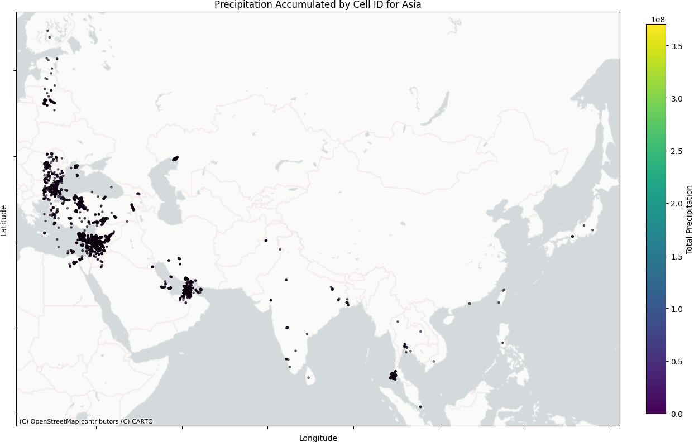

### Africa

### Australia

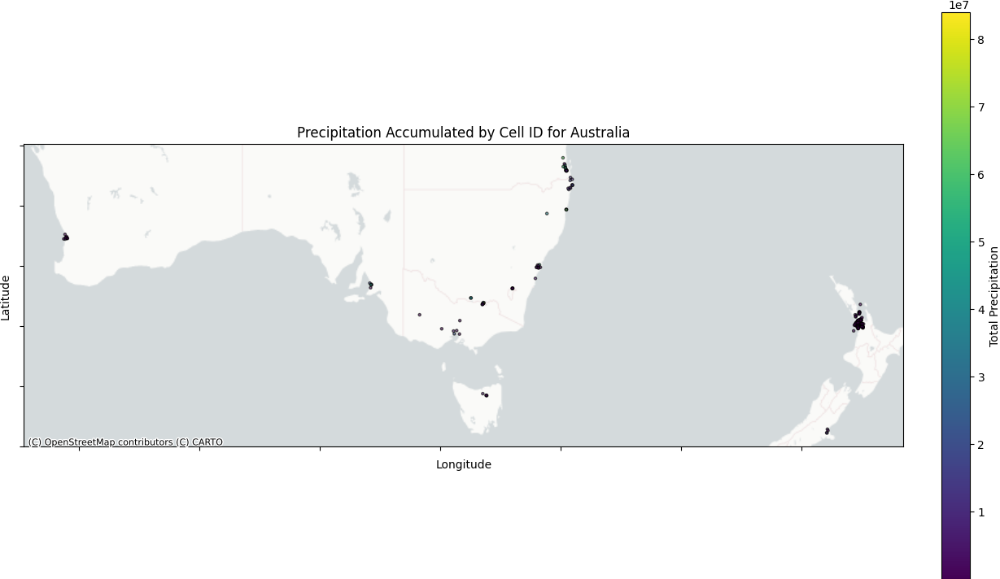

### North America

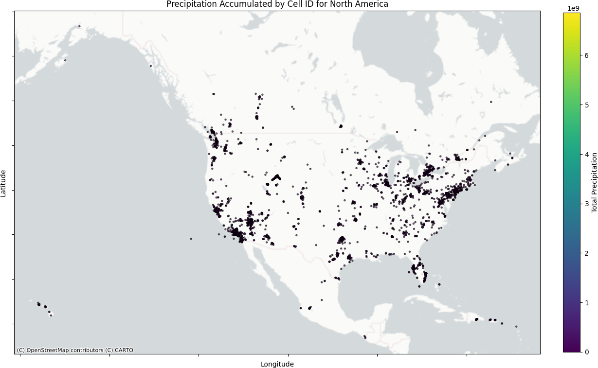

### South America

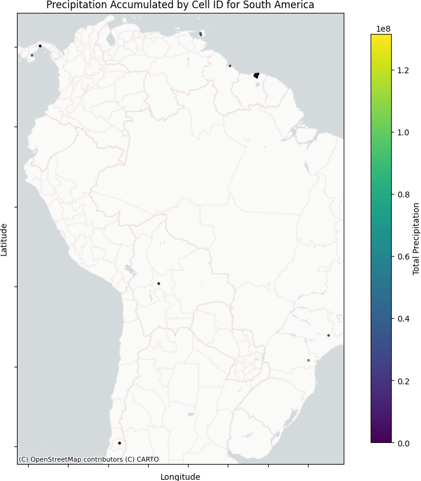

### Europe

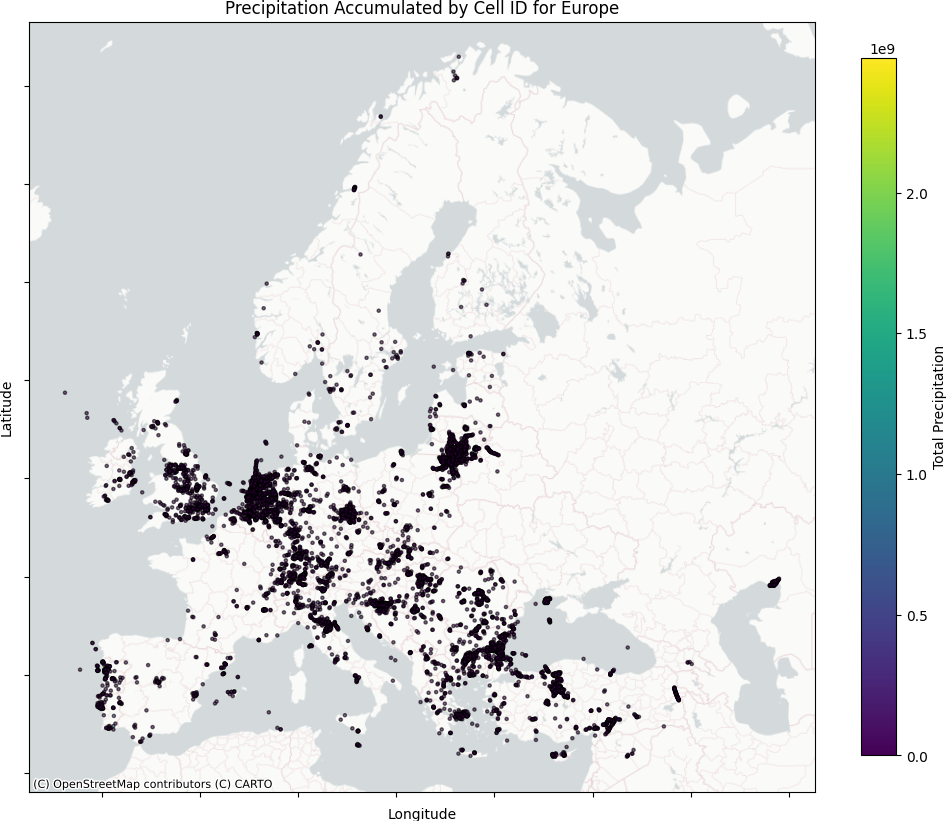

## Historical plots

### Number Of Devices

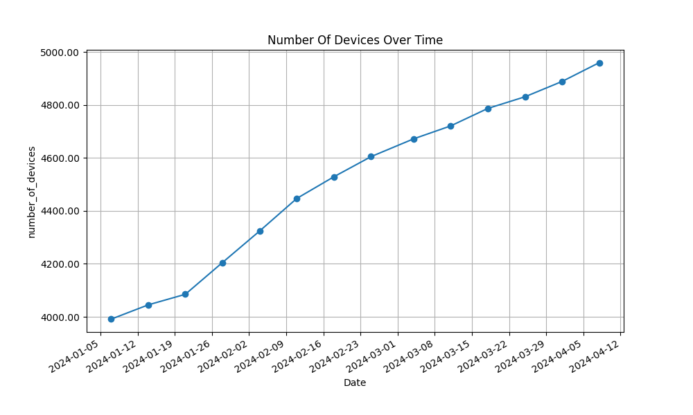

### Total Precipitation

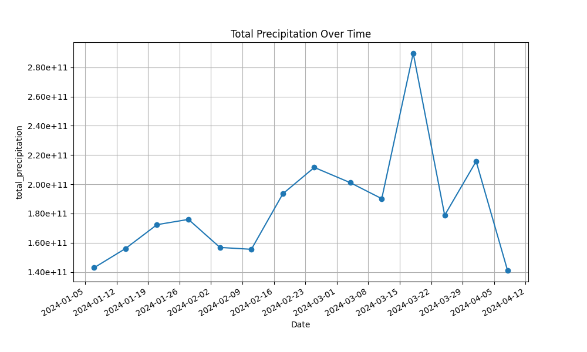

### Temperature

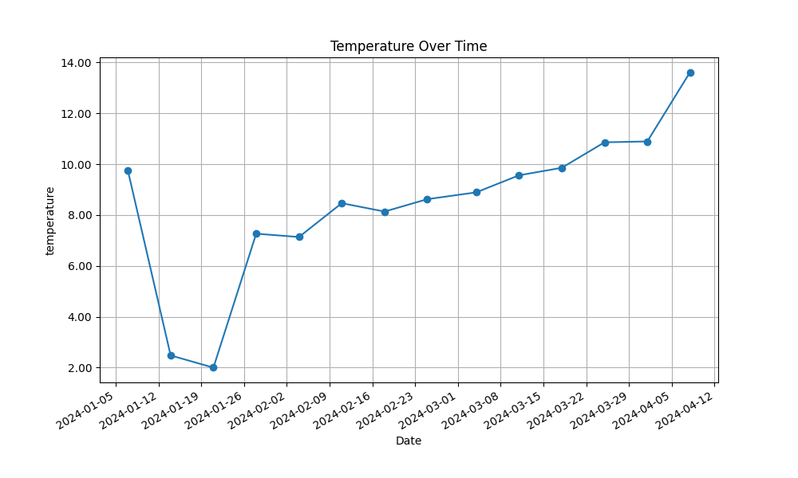

### Humidity

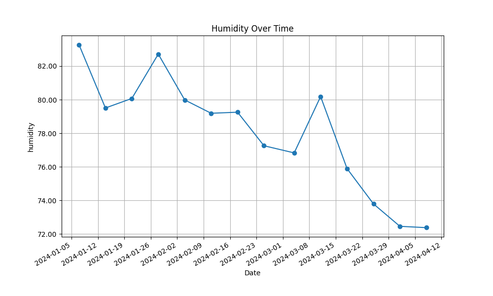

### Precipitation Accumulated

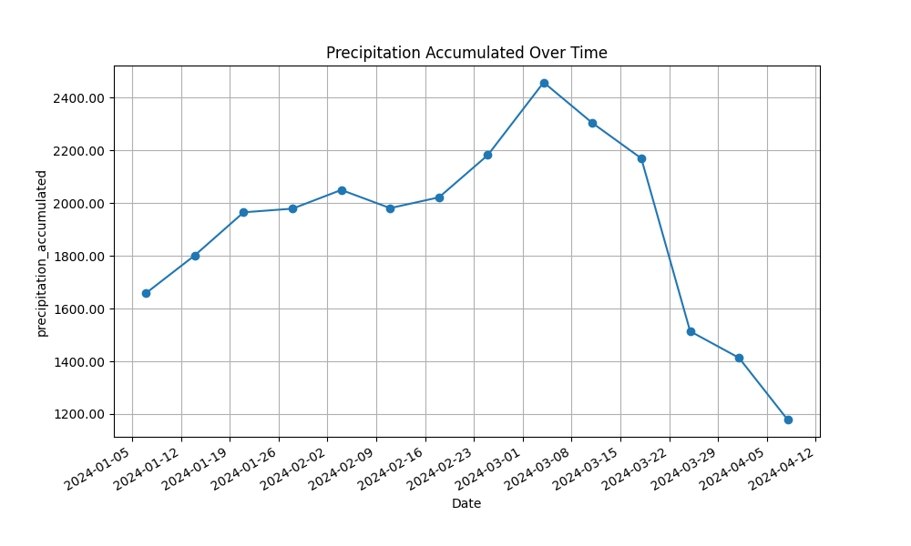

### Wind Speed

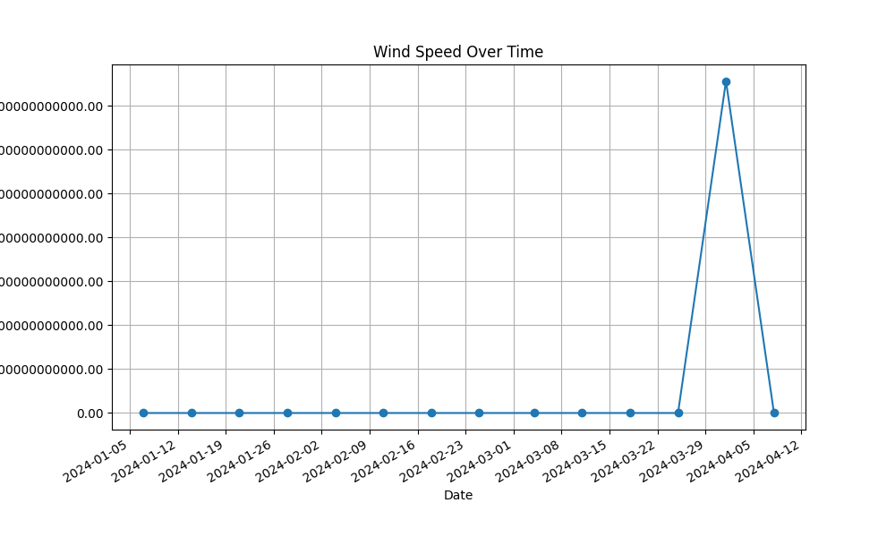

### Wind Gust

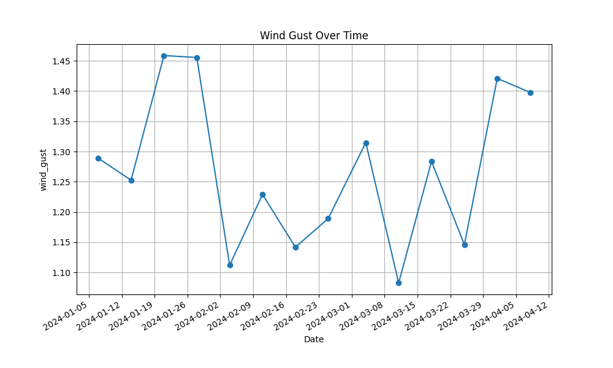

### Wind Direction

### Illuminance

### Solar Irradiance

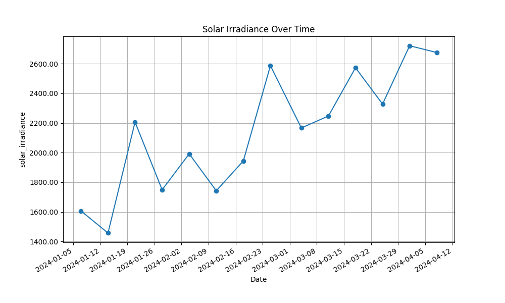

### Fo Uv

### Uv Index

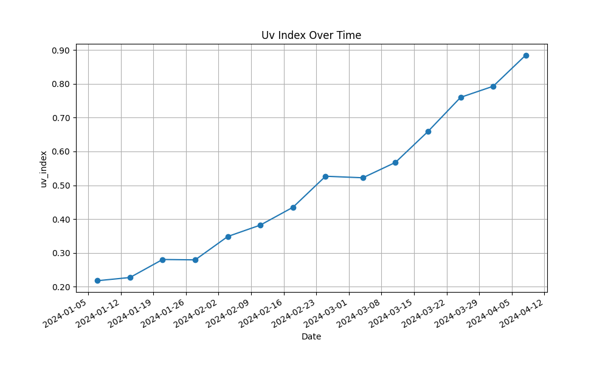

### Precipitation Rate

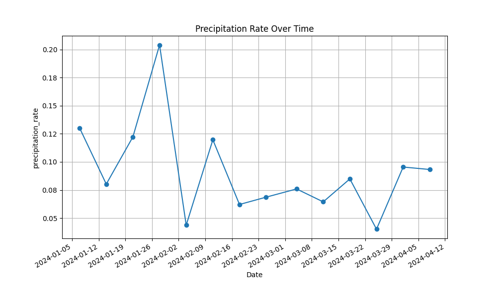

### Pressure

